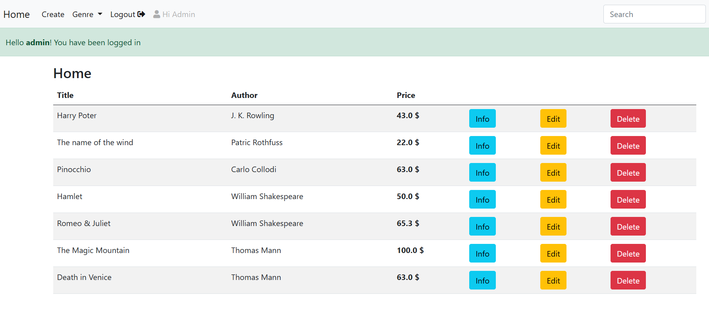
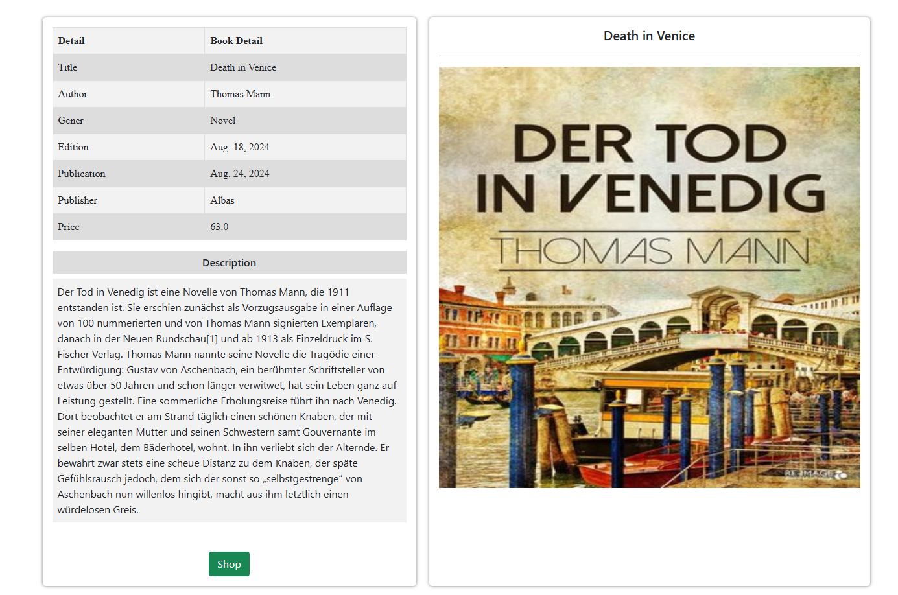

# Django Book Manager

A simple Django project for managing books.  

- **Admins**: can add, edit, and delete books  
- **Users**: can view book details and shop them  

---

## Screenshots

### Home Page


### Information Section


---

## How to Run

1. Clone the repository:  
   ```bash
   git clone https://github.com/yourusername/django-crud-library_system.git
   cd django-crud-library_system
   
2. Install dependencies:
    pip install -r requirements.txt

3. Run migrations:
    python manage.py migrate

4. Run the server:
    python manage.py runserver